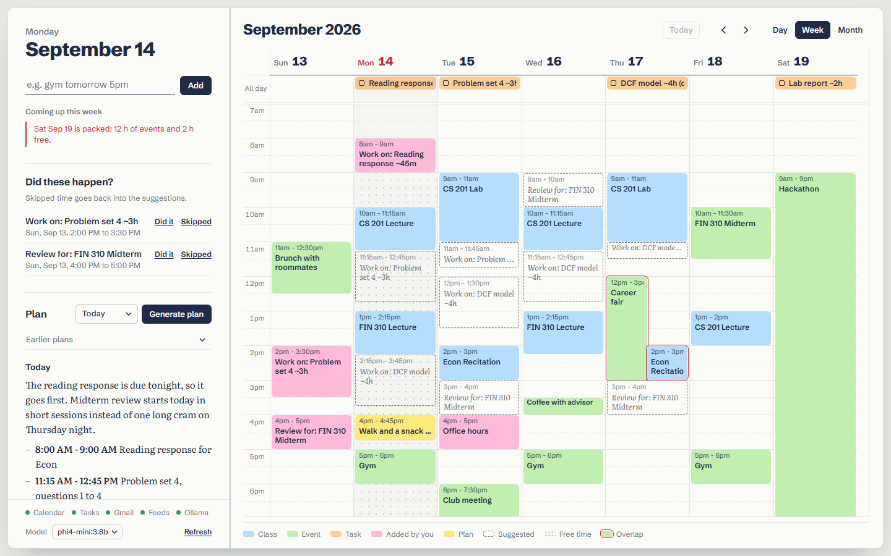
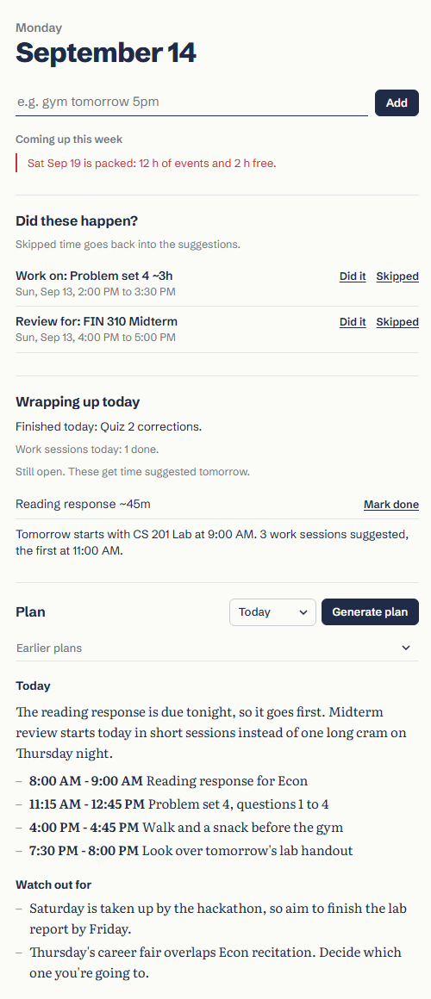

# Local AI Planner

Reads Google Calendar, Google Tasks, and unread Gmail, and generates a daily/weekly
plan using a locally-run Ollama model. No cloud AI calls, no data leaves your machine.

Screenshots use made-up sample data. To regenerate them after changing the page, run `.venv\Scripts\python.exe docs\make_screenshots.py`.

## Requirements
- Python 3.11+
- [Ollama](https://ollama.com) installed and running, with a model pulled (e.g. `ollama pull phi4-mini`)
- A Google Cloud project with the Calendar, Tasks, and Gmail APIs enabled

## Setup
1. `python -m venv .venv`
2. `.\.venv\Scripts\Activate.ps1` (Windows) or `source .venv/bin/activate` (Mac/Linux)
3. `pip install -r requirements.txt`
4. Create OAuth credentials in Google Cloud Console (Desktop app type), download as `credentials.json` in the project root. Add yourself as a test user under OAuth consent screen while the app is unverified.
5. Copy `config.example.json` to `config.json` and fill in your own context. Set `timezone` to your time zone (for example `America/New_York`); leave it blank to use your computer's. If a setting has a value the planner can't use, it tells you which one and why. The web app shows this at the top of the sidebar and keeps running on the defaults until you fix it.

## Running it

**Full plan from your Google data.** Fetches Calendar, Tasks, and Gmail, asks Ollama for a plan, and writes `output/planner_dashboard.html`:

    python plan.py --daily      # or --weekly, or --all (the default with no flag)

On Windows, `run_planner.bat` / `run_planner.ps1` do the same using `.venv`.

**Web app.** A local dashboard with your Google Calendar events and Tasks. On Windows, run `run_server.bat`: it uses `.venv`, starts Ollama if it isn't running, and opens the page in your browser. Or start it yourself:

    python server.py            # then open http://127.0.0.1:5000

- **Generate plan** streams a daily or weekly plan into the sidebar as it's written, then draws its time blocks on the calendar. Your permanent note is included as standing context. Plans are saved, so the latest one survives restarts and **Past plans…** shows earlier ones.
- **Ask AI** turns your notes into calendar events, avoiding times that are already booked. Drag one of these events to move or resize it, or click it to delete it (or everything created from the same note).
- **Quick add.** Type something like `gym tomorrow 5pm` or `dentist fri 2:30-3:30pm` in the box at the top and press Enter. Dates, times, ranges and durations (`for 2h`) are understood without the model; anything else goes to the model like an Ask AI note.
- **Study blocks.** Tasks due in the next 3 days get suggested work sessions in your free time before the deadline. A task counts as 60 minutes unless its title or notes say otherwise, like `~2h` or `est 90m`. The sessions are placed by a small optimizer (Google's OR-Tools CP-SAT solver), which treats it as a scheduling problem:
  - **Rules it never breaks:** sessions from 30 minutes up to `max_session_minutes`, a 15-minute break after each one, no more than `max_minutes_per_day` of study on any day (counting sessions you've already added), and nothing after the deadline.
  - **What it aims for, in order:** fit all the work in, putting the nearest deadlines first when time is short; stay inside your `preferred_hours`; spread a long task over several days instead of cramming it into one; prefer fewer, longer sessions; and do the work sooner rather than later. Each day's sessions then start as early as your preferred hours and calendar allow, most urgent task first.
  - Click a suggested session to see why it went there, for example "Due Tue Sep 15 (tomorrow). Split across 2 days so it isn't crammed. Inside your preferred study hours."
  - If there isn't enough free time, a warning appears in the sidebar. If OR-Tools isn't installed, a simpler earliest-free-time scheduler is used instead.
  - All of this is set in `config.json` under `study_blocks`.
- **Estimates that learn.** When you mark a task done, the planner adds up the study sessions for it that had started and asks **How long did it take?**, with that number filled in. Once 3 tasks have been measured, it compares how long they took with what was planned and adjusts future estimates to match. For example, if School tasks keep taking about 1.5× as long as you estimated, it plans more time for them. It learns separately for each task list, falls back to all your tasks for lists without enough history, and pulls small samples toward 1× so one unusual task can't throw it off. The sidebar's **Estimates** section shows what it has learned. To turn it off, set `learn_estimates` to `false`.
- **Check in on past sessions.** Once a work session you added has passed, **Did these happen?** in the sidebar asks whether you did it (or click the session on the calendar). If you skipped it, its time goes back into the suggestions instead of counting as done. Sessions you don't answer still count.
- **Exam prep.** Calendar events that look like exams (midterm, final, quiz, test) get suggested review sessions spread over the days before, ending the day before the exam: 4 hours of review for an exam and 1 for a quiz, unless the event says otherwise, like `~6h`. Tune it under `exam_prep` in `config.json`; `"days_before": 0` turns it off.
- **Coming up this week.** Warnings in the sidebar when a day is packed with events, or when work due later in the week won't fit in the free study time left before it.
- **Wrapping up today.** From 6 PM (`user_profile.review_hour`), the sidebar sums up the day: what you finished, how your work sessions went, what's still open (with a **Mark done** link), and how tomorrow starts. Anything unfinished gets time suggested again on its own.
- **Email deadlines.** Your local model reads unread emails that mention a deadline or ask for a reply, once per email. Deadlines appear as suggested all-day events, and reply requests as a suggested 15-minute block.
- Suggestions have a dashed border. Click one to add it to the planner's calendar or dismiss it, or drag a work session to a better time to add it there.
- **Mark tasks done.** Click a task on the calendar to mark it done. This only hides it in the planner (Google Tasks isn't changed), and removes any of its study sessions that haven't started yet. **Marked done** in the sidebar lets you undo it.
- Overlapping events get a red outline, and a line marks the current time. The **Connections** box shows whether Ollama is running and lets you pick which installed model to use. Google data is cached for 5 minutes; **↻ Refresh** fetches it again.

Everything the web app saves (added events, dismissed suggestions, plan history, email scan results, tasks marked done with how long they took, and session check-ins) is stored in `data/` on your machine. None of it is sent to Google.

**Canvas and other calendar feeds.** Add read-only calendar links to `config.json` under `ical_feeds`:

    "ical_feeds": [
      {"name": "Canvas", "url": "https://canvas.example.edu/feeds/calendars/user_XXXX.ics"}
    ]

In Canvas the link is under Calendar → Calendar Feed; for a Google Calendar it's the "Secret address in iCal format" in the calendar's settings. Assignments show up as tasks and get study-block suggestions; everything else shows as events. If the same calendar is also subscribed in Google Calendar, the copies are left out. These links are private, so keep them only in `config.json`, which isn't committed.

**Morning plan.** Run `schedule_morning_plan.bat` once to create a daily Windows task (7:00 by default, or pass a time like `schedule_morning_plan.bat 06:30`). Each morning it runs `run_planner.bat --daily --notify`, which starts Ollama if needed, writes the plan, and shows a notification with what's due, what's next, and any sessions to check in. Clicking the notification opens the web app if it's running, or the saved dashboard otherwise. To remove it: `schtasks /Delete /TN "Planner morning plan" /F`.

**Evening review.** Run `schedule_evening_review.bat` once (9:00 PM by default, or pass a time) for a daily notification with the sessions to check in, the tasks still open, and how tomorrow starts. It runs `run_planner.bat --review`, which doesn't need Ollama. To remove it: `schtasks /Delete /TN "Planner evening review" /F`.

Both the web app and the morning run write to `data/planner.log`, including the reason for any failure. If a morning plan didn't show up, look there first.

The first run of either one opens a browser window for Google's OAuth consent (with `server.py`, the page keeps loading until you finish signing in). This only happens once; after that, `token.json` is cached locally.

## Tests

    python -m unittest discover -s tests -v